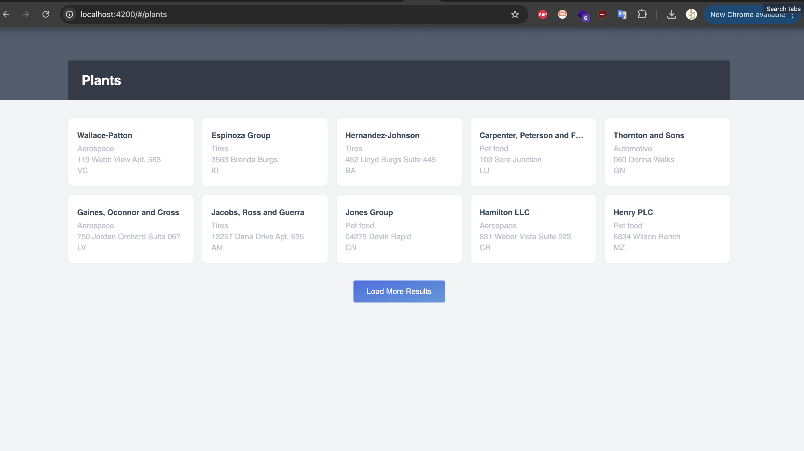
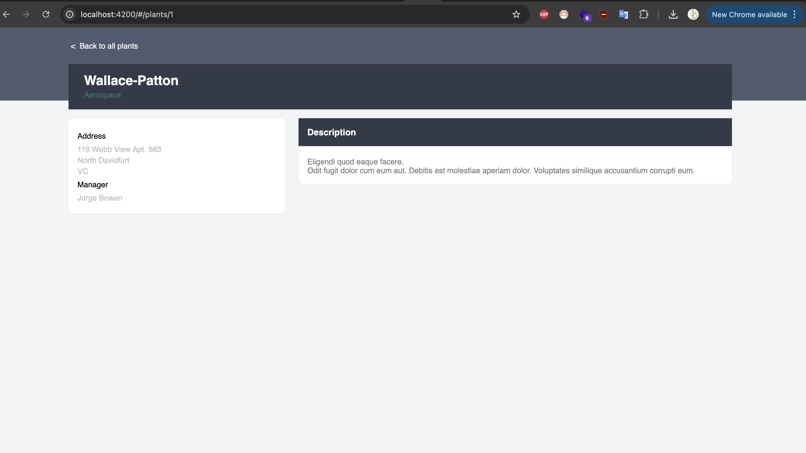

# PlantShelf

Welcome to **PlantShelf**, a web application for managing and displaying a collection of plants, built with Angular 19.2.0. This project allows users to browse a paginated list of plants, view details, and load more plants dynamically.

## Prerequisites

Before you begin, ensure you have the following installed:
- [Node.js](https://nodejs.org/) (version 18.x or later recommended)
- [Angular CLI](https://angular.dev/tools/cli) (version 19.2.0)
- A modern web browser (e.g., Chrome, Firefox)

## Installation

**Install Node Modules**:
   Install the project dependencies using npm:
   ```bash
   npm install
   ```

## Running the Application

To start the development server:
```bash
ng serve
```

- Open your browser and navigate to `http://localhost:4200/`.
- The application will automatically reload when you modify source files.

## Running Unit Tests

To execute unit tests using [Karma](https://karma-runner.github.io):
```bash
ng test
```

This runs the test suite for the application, ensuring components like `PlantListComponent`, `PlantDetailsComponent` and `CardComponent` function correctly.

## Project Structure

- **`src/app`**: Contains the main application code, including components (`PlantListComponent`, `CardComponent`, `PlantDetailsComponent`), services (`PlantService`), and models (`Plant`, `PlantListResponse`).

## Building for Production

To build the project for production:
```bash
ng build
```

The optimized build artifacts will be stored in the `dist/` directory.

## Screenshots





## Additional Resources

- [Angular CLI Documentation](https://angular.dev/tools/cli)
- [Angular Official Website](https://angular.dev/)